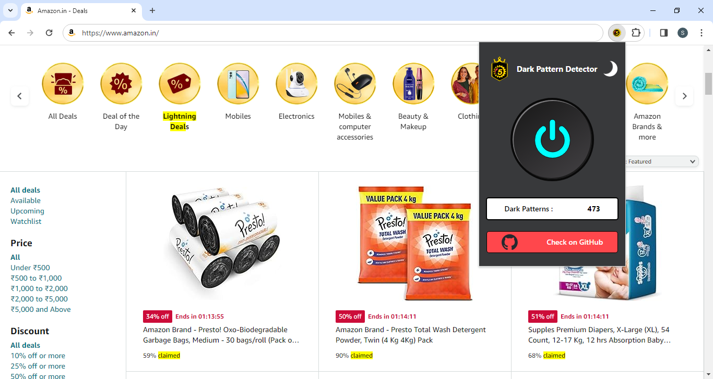

<h1 align="center">
<br>
 Dark Pattern Detector
<br>
</h1>

<h4 align="center">Extension for detecting dark patterns on various e-commerce websites</h4>

<p align="center">
  <a href="#Introduction">Introduction</a> •
  <a href="#Features">Features</a> •
  <a href="#Screenshots">Screenshots</a> •
  <a href="#Installation">Installation</a> •
  <a href="#Usage">Usage</a> •
  <a href="#About">About </a> 
</p>

## Introduction
Browser extension to identify and highlight dark patterns on various e-commerce websites. 
Dark patterns are manipulative design elements and techniques which are meant to trick or misguide the user. Dark patterns are commonly employed by e-commerce websites to influence user behaviours and decisions.

## Features

 - **Real-Time Detection:** Highlights dark patterns on various webpages in real-time.
 - **Count Display:** Displays number of dark patterns detected.
 - **Dark/Light Mode:** Available in both Dark and Light theme to prevent eye strain.
 - **Dark Patterns Dataset:** Large dataset containing more than 2000 phrases involving dark patterns.
 - **Easy to Use UI:** Ability to toggle ON/OFF the extension.
 
## Screenshots
 
 
## Installation
To install the extension, either clone the repository using
```
git clone https://github.com/SAHIL-KUMAR-EE/fifth-gear.git
```
Or download the ZIP file by clicking on _Code_ and then ***Download ZIP***

### Chrome
1. Open the Extension Management page by typing `chrome://extensions` in URL bar 
OR
Click on the Extensions Icon and select **Manage Extensions** at the bottom.
3. **Turn on Developer Mode** by clicking the toggle switch next to Developer mode.
4. Click on **Load unpacked** button and select the `chrome` folder/directory.

Note - You can also pin the extension by clicking on the Extensions Icon and then clicking the **Pin** icon.

## Usage
To use the extension, simply click on its icon in the extension's panel and then press the toggle button.
Depending upon the website, the dark patterns would be highlighted and the count of dark patterns would be displayed.

Note - Clicking the toggle button again turns off the extension and reloads the webpage. 
You may also toggle between Dark and Light theme by clicking on Sun 🌞 and Moon🌙 icon at the top right corner.

## About
The Dark Pattern Detector extension is made in response to the challenge posed by [Dark Patterns Buster Hackathon (DPBH 2023)](https://dpbh2023.in/) regarding manipulative dark patterns present on various e-commerce websites. 

Team Fifth-Gear, Punjab Engineering College, Chandigarh
